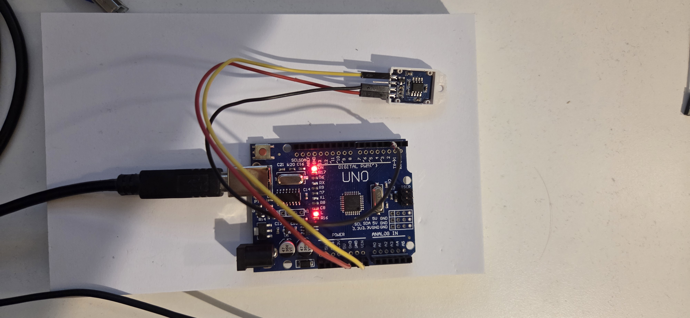
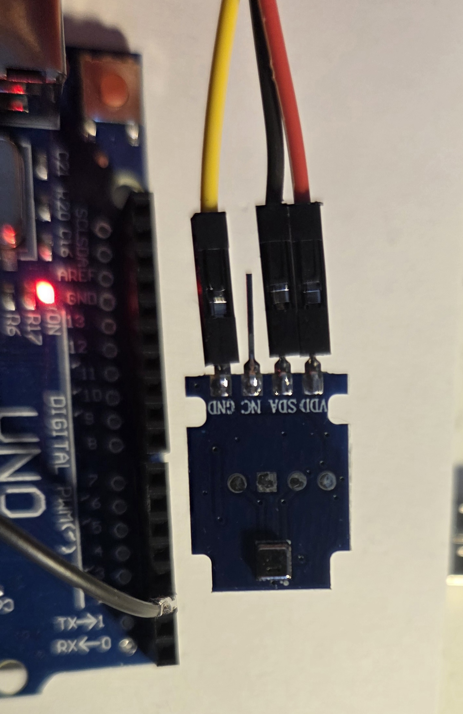
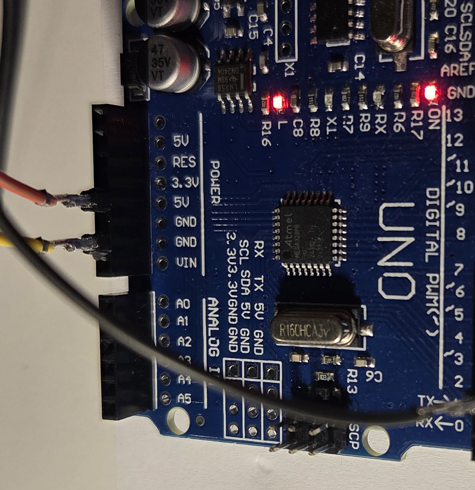
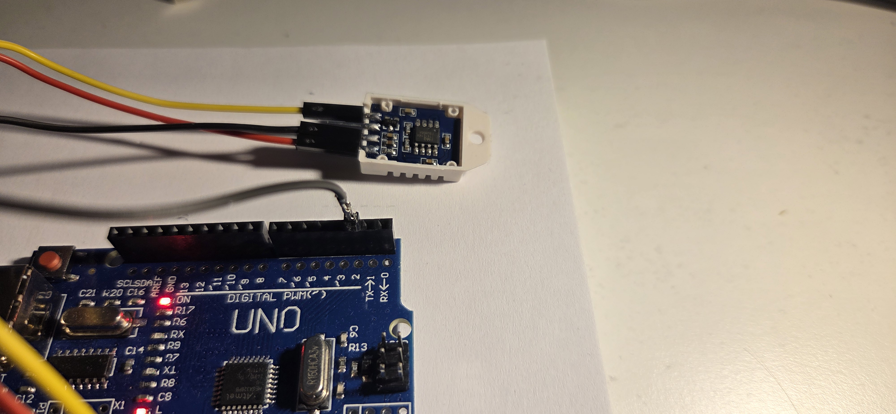
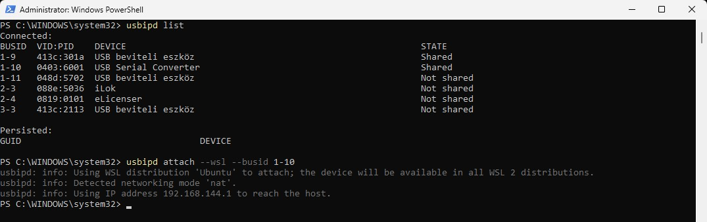

# IoT mérőrendszer Arduino UNO-val

## Projekt célja
A projekt célja egy egyszerű IoT jellegű mérőrendszer megvalósítása Arduino UNO mikrokontroller segítségével.  
A rendszer hőmérséklet- és páratartalom-adatokat mér, majd az eredményeket Linux környezetben fájlba naplózza, és automatikusan feltölti GitHub-ra.

## Hardver
- Arduino UNO Rev3
- DHT22 (AM2302) hőmérséklet- és páratartalom szenzor

## Hardver összeállítás

### Teljes rendszer

### Szenzor bekötése

### Tápfeszültség bekötése

### Adatvezeték

### USB eszköz átadása WSL-nek

### Szenzor bekötése
| Szenzor pin | Arduino pin |
|------------|-------------|
| VDD | 5V |
| SDA (DATA) | D2 |
| GND | GND |
| NC | nincs bekötve |

## Szoftver környezet
- Windows + WSL2
- Linux (CLI-only környezet)
- arduino-cli
- systemd timer
- git (SSH alapú hitelesítéssel)

## Működés
Az Arduino 5 másodpercenként méri a hőmérsékletet és a páratartalmat, és az adatokat soros porton továbbítja.  
A Linux rendszer a soros porton érkező adatokat feldolgozza, és időbélyeggel ellátva CSV fájlba menti.

## Automatizálás
A mérés és a feltöltés systemd timer segítségével automatizált:
- napi 3 mérés (06:00, 12:00, 18:00)
- napi egyszeri automatikus GitHub push
- 3 nap után automatikus leállás

## Könyvtárstruktúra

IOT/
├── arduino/
│ ├── hello_serial/
│ └── dht22_meres/
├── scripts/
│ ├── measure_once.sh
│ └── push_daily.sh
├── docs/
│ └── meresek.csv
├── images/
│ ├── setup_overview.jpg
│ ├── sensor_wiring.jpg
│ ├── pwr_gnd_wiring.jpg
│ ├── data_wiring.jpg
│ └── usb_port_attachment_to_wsl.jpg
└── README.md
